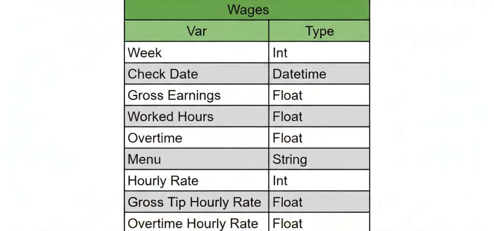

# Ala's New Menu: AB-Test

## Executive Summary
Ala, an Eastern Mediterranean restaurant, has been losing revenue for the past few months. To increase revenue and provide higher quality food, Ala changes its menu around mid-year. An effective menu change results in a 10 - 15% increase in revenue. The earnings of a server at this restaurant are used to determine whether or not the change in menu was a success. Through A/B testing using Mann-Whitney U Test, Confidence Interval, and Power, it was found the new menu performs 34% worse than the old menu. A restoration of the old menu with a few dishes changed was recommended. 

----
# Background and Overview
Restaurants change their menu, or at least tweak some of their dishes, seasonally. This is done for many reasons, including increasing customer retention rates, increasing customer acquisition rates, or simply increasing revenue. In fact, a restaurant’s revenue can increase by 10 - 15% after a menu change <a href="https://getsling.com/blog/menu-engineering/#:~:text=In%20most%20cases%2C%20when%20you,process%20every%20year%20or%20two." target="_blank">(Sling)</a>. Ala, an Eastern Mediterranean Restaurant, recently changed its menu with the main goal of increasing its current revenue. Ala wants to see if the new menu performs better than the old menu in revenue generation. Using a server’s gross income data, the new and old menu are A/B tested to determine which is better at generating revenue.

----
## Data Structure Overview

The data comes from bi-weekly checks issued to the employee. Twenty observations were captured in the dataset. From the checks, the features week, check date, gross earnings, worked hours, and hourly rate are extracted for each observation. Features such as gross tip, menu, and overtime hourly rate are later engineered. Gross tip hourly rate is [gross earnings - (hourly rate x worked hours)]/worked hours. It is engineered to check if tips behave differently from hourly rate wages and overall gross earnings over time. The menu is engineered to keep track of revenue (Gross earnings) over time as it transitions from the old menu to the new one. Overtime hourly rate is generated to be used in calculating the gross tip hourly rate. 
 
 ---- 

## Methods
**A/B Test**
It is used to compare the performance of different versions of a product. It uses statistical tests, confidence intervals, and power to determine which product performs better at a given metric.

**Mann-Whitney U-test**
It is a non-parametric statistical test mainly used when the data has a distribution that does not approximate normal. It is ideal for small datasets with 5 observations or more. It also requires two independent sample groups where the variable being measured is continuous. This project uses the Mann-Whitney U-test to determine if the revenue (gross earnings) generated by the new menu is greater than the revenue generated by the old menu.

**Confidence Interval**
This is the range of values you expect your estimate to fall between if you redo your test, within a certain level of confidence.

**Power**
It is the probability of a hypothesis test correctly rejecting the null hypothesis when it is false. In other words, it is the ability of a test to detect a real effect when one truly exists

----  
## Findings

**Gross Revenue Over Time**

This is the gross revenue 3 months before and 5 months after the menu change. Gross revenue peaks at the introduction of the new menu (Orange), and starts to dwindle thereafter. The following graph quantifies this loss.

**Old vs New Menu**

After 6 weeks, gross revenue for the new menu average at $2318.2 dollars for this server which is $790.3 or 34.1% less than the old menu in the same amount of time. This 34.1% average loss in revenue requires further investigation to determine that it is not obtained merely by chance. A statistical test can be deployed to determine that this result has statistical significance 

**Mann-Whitney U-test**

The Mann-Whitney U-test method uses two different lists, newMenu and oldMenu. Each list is a subset of the values that belong to the new and old menus, respectively. The parameter “alternative” (for the alternative hypothesis) is set to “less” since our null hypothesis is that the new menu’s profit is higher.  The function is executed, outputting 3 for the U-statistic and  0.01 for the P-value. When the P-value is compared to the 0.05 alpha, it can be concluded that the new menu does not increase revenue.

**Confidence Interval**

The confidence interval is calculated by generating and collecting the difference of 10,000 sample means for the old and new menu, respectively. In other words, 10,000 sample means were generated for the old menu, and another 10,000 sample means were generated for the new menu. The difference between the old and new menu sample means was taken as they were generated and collected in a series called twoSampleDataset. This variable consists of the 10,000 sample means collected, and it is used to calculate statistical parameters. These parameters are then used to calculate a 95% confidence interval.

Our actual mean or average bi-weekly loss is -790.2. This confirms our initial 34% average loss result, and fits our 95% confidence interval since it falls within -798.1 and -788.6. This means we can expect to lose anywhere from 788.6 to 798.1 every two weeks per server. The robustness of this confidence interval is further supported by power.

**Power Graph**

The power graph is generated by simulating and plotting 100 p-values from the Mann-Whitney U-test at different sample sizes. These samples range from 5 observations to 500. Here, our P-values never go above our significance level of 0.05, showing that our power approximates 100%. This is an unusual result since power rarely approximates 100%. It might be due to the size of our original sample. However, this result suggests that the probability of our hypothesis being rejected and the confidence interval being true is high

## Conclusion and Recommendations
- Ala’s new menu is about 34% worse than the old menu. 
- The restaurant loses about 34% or $790.2 per server in gross revenue every two weeks.
- The old menu needs to be restored with a few new dishes added
- New dishes should be A/B tested periodically to ensure compatibility with the existing menu
